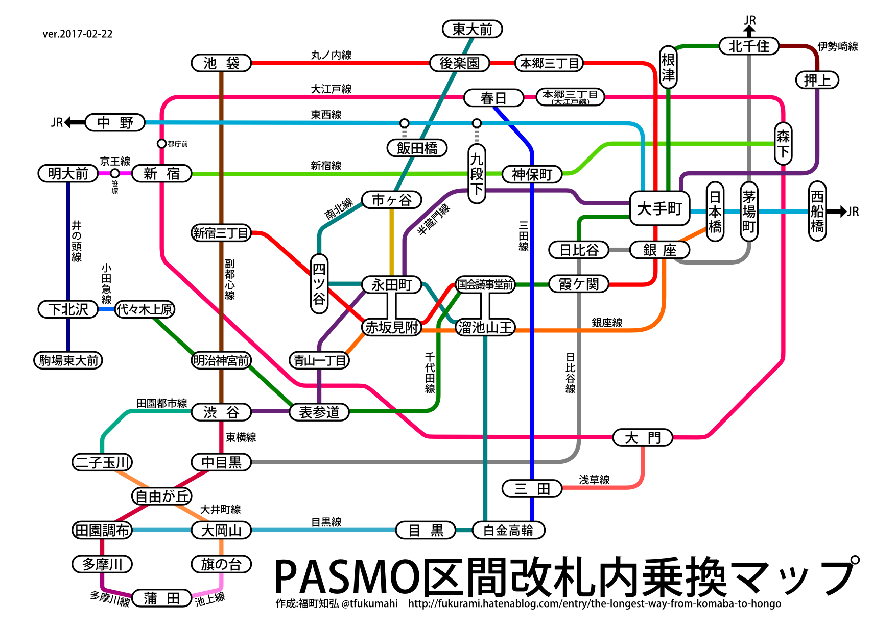

PASMO区間大回りソルバ(東大関係特化)
========

作成者:福町知弘 ([twitter](https://twitter.com/tfukumahi)/[blog](http://fukurami.hatenablog.com))

## 概要

首都圏におけるPASMO導入区間のうち、改札を経由しない（中間改札も）で乗車可能な範囲内での最長経路を探索するjavascript製ソルバです。東京大学のキャンパスがある駒場・本郷の最長経路を探索するために製作したため、直接的に関係しない駅等は省いてあります。

[Github Pages上で利用可能です。](https://fukurami.github.io/lop-solver-ut/)

## 動作環境

javascriptが有効な、ES6(ES2015)が十分に実装されたブラウザ。

Firefox、Google Chromeの最新版であれば問題ありません。

## 探索の原則

概ね鉄道界隈で主流の大回りルールに則っています。
具体的には、

* 同一駅を二度以上経由しない
* 同一区間を二度以上利用しない
* 経路は一筆書きとなる

を原則とし、PASMO（ICカード全般も含む）の特例として

+ 別事業者の同一名称駅は別個の駅として扱う（内部データが異なるため）

というものがあります。特記事項としては、

- 永田町-赤坂見附のような別名称改札内接続駅については別個のものとして扱う  
（「永田町」と「赤坂見附」をそれぞれ一回ずつ経由する場合はセーフ）

があります。なお、以上の記述は「[東京近郊区間大回り Wiki](http://wikiwiki.jp/omawari/?FrontPage)」を参考にしたものです。

本ソルバでは、いわゆる「6の字」経路や一周経路（O型・P型とも呼ばれる）には対応していません（面倒だったので）。

また、本ソルバでは中間改札を経由する乗換（いわゆる「ラッチ外接続」）は排除しました。例えば飯田橋駅での南北線/有楽町線から東西線への乗換は、中間改札を経由しない経路が無いため考慮しません。（但し、同一事業者の同一名称駅のため南北線飯田橋駅を通った場合東西線飯田橋駅も経由済の扱いになります。）

探索方法は深さ優先の全探索です。故に結果は最長のものであると保証されます。

## 使い方

「発駅」に出発する駅を指定して下さい。「着駅」1～2に到着する駅を2つまで指定して下さい。1つのみ指定する場合は片方を空欄にすると検索が高速化されます。

「JRを含める」をチェックすると、Suica区間（東京近郊区間のみ）を含めた経路を簡易的に計算します。JR区間の最長経路は「[最長大回り経路を計算する](http://nijzero.dw.land.to/document/ldr.html)」に掲載されている計算済みのものをお借りしました。

計算は概ね十数秒～数分程度かかります。利用者のブラウザで実行されるため、計算時間は利用者のマシンスペックに依存します。製作者の環境では平均して1分半～2分程度でした。CPUをかなり使うので注意が必要です。

計算が終わると、結果表示欄に最長経路とその距離が表示されます。「各駅での累計距離を入れる」をチェックすると、始点から経由する各駅までの営業キロが駅ごとに表示されます。

結果表示欄の右側の「txt保存」リンクを押すことで、表示されている結果をtxt形式でダウンロードできます。

## 計算に使用したデータについて

計算に使用した駅データは「[最長大回り経路を計算する](http://nijzero.dw.land.to/document/ldr.html)」にて配布されているagain@T氏製作のruby製ツール附属のデータを製作者が大幅に改変して作成しました。

計算量削減のため、複数路線が接続していない駅は原則として削除し、また例えば飯田橋-市ヶ谷間のように複数路線（南北線・有楽町線）が同一区間を走っている場合は原則駅間（営業キロ）が最長のもののみを残し削除しています。

また、東大関係特化の名の通り、東大関係の最長経路探索に主眼を置いているため、無関係な盲腸経路はすべて削除しています。

実装済みの路線データは以下の図の通りです。  


## 高度な使い方

結果表示欄下の方の「＊」をクリックすると、計算時の内部データを格納したテキストエリアと、「簡略版を使う」チェックボックスが表示されます。後者にチェックすることで、ノード数を減らし最適化したデータを使い計算を行うことができます。但し、通常データにある駅の一部は削除されているため、東大最寄りの駅以外は発・着駅に指定しない方が良いです。また、JRは（「JRを含める」チェックに拘らず）計算に含めません。

### 路線データのカスタマイズ

計算に使用する路線のデータを差し替えることで、例えば関西の大都市近郊区間など、他の区間での大回り経路計算が可能です。

路線データは[rosen_data.js](rosen_data.js)で定義されています。  
rosen_data.jsで定義されている`ROSEN`オブジェクトには以下の各データが含まれます。

* `rosen_data` : PASMO区間の路線データ
* `jr_data` : JR区間を含める場合の追加データ
* `main_stations` : 駅セレクタで優先的に表示する駅
* `o_connects` : 同事業者の改札外接続駅

`rosen_data`および`jr_data`は以下のフォーマットで定義されます。

```javascript
[
	{
		name:"路線名", //路線名(「丸の内線」など)
		stations:[ //路線に所属する駅リスト
			{
				name:"駅名1", //駅名(「池袋」など)
				km:1.4  //キロ程(累計)
			},
			{name:"駅名2",km:2.7}
		]
	}//,
	//{ name:"路線名B", ...
]
```

複数の路線で同じ駅名を定義すれば、自動的に各路線が改札内接続しているものとしてグラフが作成されます。接続させたくない場合は名前を適宜変更して下さい。`km`には累計キロをセットします。A駅からB駅の距離が1.3km、B駅からC駅の距離が0.8kmの時、累計キロはA駅:0km、B駅:1.3km、C駅:2.1kmとなります。

`main_stations`には、駅セレクタで先頭に表示したい駅(`rosen_data`で定義済みのもの)を文字列の配列の形でセットして下さい。

`o_connects`には、次のように改札外接続する駅(`rosen_data`で要定義)を2次元配列の形でセットします。

```javascript
[
	["駅名1","駅名1(ほげほげ線)"],
	["駅名2","駅名2(ぴよぴよ線)","駅名3"]
]
```
この場合、駅名1と駅名1(ほげほげ線)が一まとまりとして認識され、駅名1を経由した場合自動的に駅名1(ほげほげ線)が以後経由不能になります。配列は3つ以上でも可です。この設定をすることで、九段下駅など改札内接続していない同事業者駅がある場合に対応できます。

普通は`ROSEN`を再定義すれば事足りますが、より高度なカスタマイズをする方に向けて、路線データからソルバで解を求めるまでの処理例を書いておきます。
```javascript
let graph = new Graph(rosen_data, o_connects); //無向グラフのインスタンスを生成
let solver = new Solver(graph); //ソルバのインスタンスを生成

let begin_point_id = graph.findPoint("発駅名"); //駅名からグラフ内の駅idを検索
let end_point1_id = graph.findPoint("着駅名1");
let end_point2_id = graph.findPoint("着駅名2");

let result = solver.search(begin_point_id, end_point1_id, end_point2_id); //最長経路探索処理

console.log("経過時間", result.time); //結果表示
console.log("累計距離", result.value);
console.log("経路", result.toString());
console.log("経路(各駅累計距離付)", result.toString(true));
```
